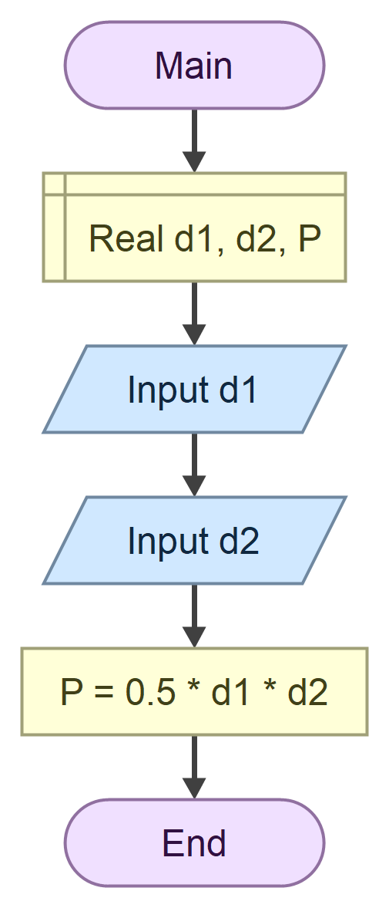

# Domaci zadatak iz tehnicke dokumentacije

## zadatak

Program koji na osnovu unetih duzina **dijagonala** romba d1 i d2 izracunava **povrsinu** P

## formula
$$
\frac{1}{2} d_1 \times d_2
$$

### algoritamska sema 



## resenje

```cs
using System;

class Program
{
    static void Main()
    {
        Console.WriteLine("Unesite duzinu dijagonale d1:");
        double d1 = double.Parse(Console.ReadLine());

        Console.WriteLine("Unesite duzinu dijagonale d2:");
        double d2 = double.Parse(Console.ReadLine());

        double P = (d1 * d2) / 2;

        Console.WriteLine($"Povrsina romba iznosi: {P}");
        
        Console.WriteLine("Pritisnite Enter za kraj...");
        Console.ReadLine();
    }
}
```

### test primeri

test primer 1:

```text

Unesite duzinu dijagonale d1:
12
Unesite duzinu dijagonale d2:
23
Povrsina romba iznosi: 138
Pritisnite Enter za kraj...


C:\Users\nikol\source\repos\ConsoleApp2\ConsoleApp2\bin\Debug\ConsoleApp2.exe (process 15368) exited with code 0 (0x0).
To automatically close the console when debugging stops, enable Tools->Options->Debugging->Automatically close the console when debugging stops.
Press any key to close this window . . .
```

Test primer 2:

```text
Unesite duzinu dijagonale d1:
15.63
Unesite duzinu dijagonale d2:
21.14
Povrsina romba iznosi: 165.2091
Pritisnite Enter za kraj...


C:\Users\nikol\source\repos\ConsoleApp2\ConsoleApp2\bin\Debug\ConsoleApp2.exe (process 12076) exited with code 0 (0x0).
To automatically close the console when debugging stops, enable Tools->Options->Debugging->Automatically close the console when debugging stops.
Press any key to close this window . . .
```

### Objekti

| Redni broj | Naziv promenljive | Tip promenljive |
|------------|-------------------|-----------------|
|1.          |`d1`               | `double`        |
|2.          |`d2`               | `double`        |
|3.          |`P`                | `double`        |
