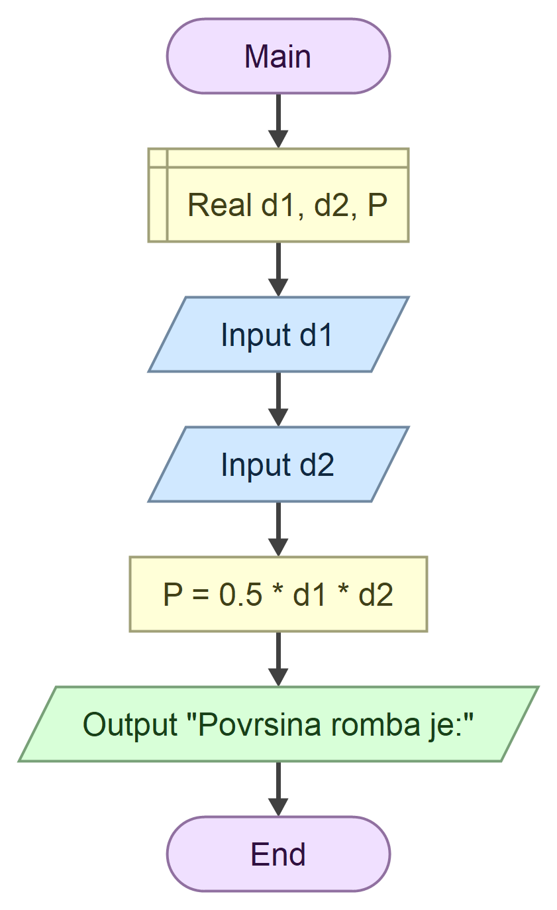

# Domaci zadatak iz tehnicke dokumentacije

## zadatak

Program koji na osnovu unetih duzina **dijagonala** romba d1 i d2 izracunava **povrsinu** P

## formula
$$
\frac{1}{2} d_1 \times d_2
$$

### algoritamska sema 

